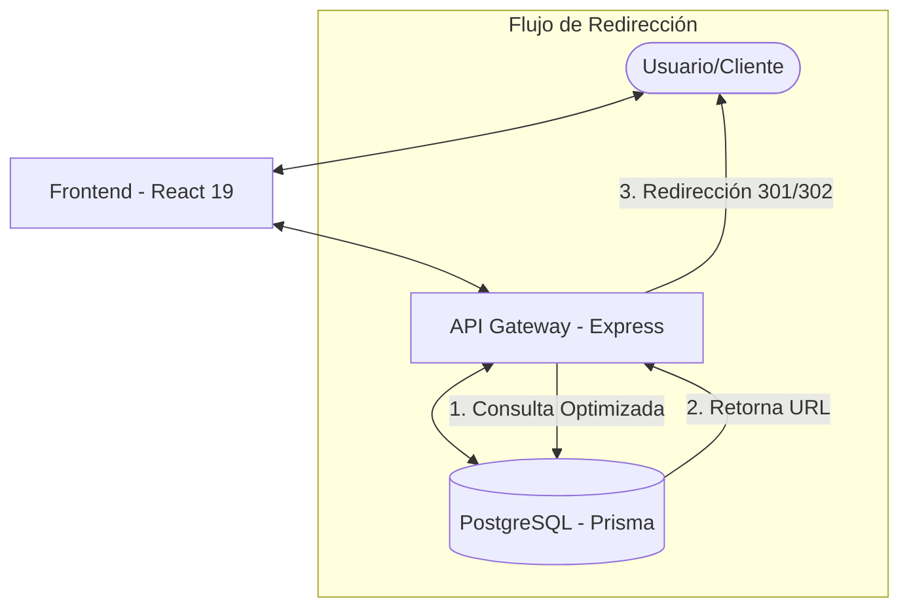

# 🔗 Knot.ly

[](https://www.typescriptlang.org/)
[](https://reactjs.org/)
[](https://nodejs.org/)
[](https://www.postgresql.org/)

**Knot.ly** es una solución Full-Stack de acortamiento de URLs de alto rendimiento diseñada para la velocidad, escalabilidad y una experiencia de usuario excepcional. Este proyecto demuestra la implementación de patrones modernos de desarrollo, desde la gestión de caché distribuida hasta el análisis de datos en tiempo real.

## 🚀 Puntos Destacados

- ⚡ **Redirecciones optimizadas**: Sistema de consultas eficientes a PostgreSQL con índices estratégicos para garantizar tiempos de respuesta rápidos.
- 📊 **Analytics en tiempo real**: Sistema de rastreo granular que captura clics, procedencia geográfica y dispositivos mediante una arquitectura escalable.
- 🔐 **Seguridad robusta**: Autenticación vía JWT, hashing de contraseñas con Bcrypt y Rate Limiting para prevenir abusos del API.
- 📐 **Arquitectura Limpia**: Separación clara de responsabilidades con un backend estructurado por servicios y un frontend basado en componentes reutilizables y hooks personalizados.

## 🏗️ Arquitectura del Sistema

El sistema utiliza un flujo de datos optimizado para priorizar la velocidad de redirección, el caso de uso principal del producto.



## 🛠️ Stack Tecnológico

| Capa | Tecnologías Clave |
| :--- | :--- |
| **Backend** | Node.js, TypeScript, Express, Prisma ORM |
| **Frontend** | React 19, Vite, TailwindCSS, React Router 7 |
| **Infraestructura** | PostgreSQL (Persistencia), Docker |
| **Validación/Tipado** | Zod, TypeScript (Strict Mode) |

## 💡 Desafíos Técnicos y Soluciones

### 1. Sistema de Codificación Base62
En lugar de IDs numéricos simples, implementé una utilidad personalizada de Base62 para generar alias cortos (`knot.ly/aB34z`), optimizando la longitud del enlace y la estética visual.

### 2. Optimización de Consultas con Prisma
Las redirecciones utilizan índices únicos en PostgreSQL para garantizar búsquedas O(log n) extremadamente rápidas. Prisma ORM proporciona type-safety completo y previene inyecciones SQL.

### 3. Analytics Escalables
El frontend procesa grandes volúmenes de datos de clics mediante **Recharts**, proporcionando una visualización clara y responsive de las métricas de rendimiento de cada enlace.

## 📂 Estructura del Monorepo

```
knot.ly/
├── backend/     # API REST con Node.js + Express + PostgreSQL
└── frontend/    # Aplicación SPA (Single Page Application)
```

## 👨‍💻 Autor

**Andrés Sánchez**  
*Ingeniero de Sistemas, Desarrollador y Analista de Datos*

[GitHub](https://github.com/Sanchez042004) | [LinkedIn](https://www.linkedin.com/in/andres-sanchez04/)

---
